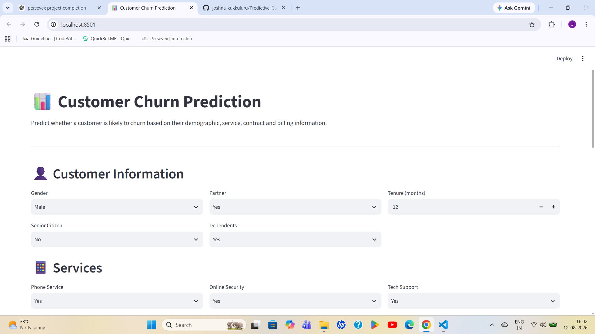
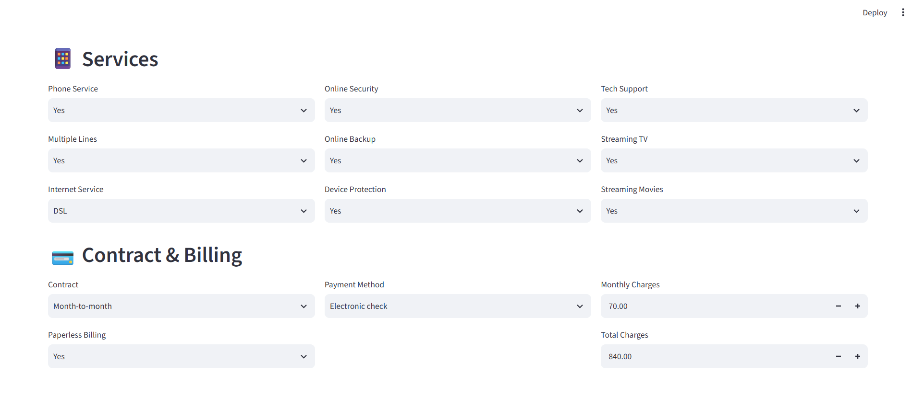
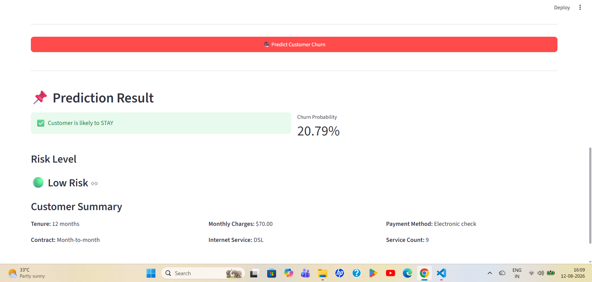

# Predictive Customer Churn Prediction

## 📌 Project Overview

Customer churn prediction is the process of identifying customers who are likely to stop using a company's services.

This project uses Machine Learning to predict whether a customer is likely to churn based on demographic, service, contract, and billing information.

The final model is implemented using **XGBoost** and deployed as an interactive **Streamlit web application**.

---

## 🌐 Live Demo

🚀 **Try the deployed application:**

https://predictivecustomerchurnproject-kqwwvztcmnrzjfmndrc6nd.streamlit.app/

> The application allows users to enter customer information and receive a churn prediction, probability score, risk level, and customer summary.

---

## 🎯 Objectives

- Predict whether a customer is likely to churn.
- Identify important factors influencing customer churn.
- Compare different machine learning models.
- Evaluate model performance using multiple metrics.
- Use SHAP for model explainability.
- Deploy the final model through a Streamlit application.

---

## 🛠️ Technologies Used

- Python
- Pandas
- NumPy
- Matplotlib
- Seaborn
- Scikit-learn
- XGBoost
- SHAP
- Joblib
- Streamlit
- Jupyter Notebook

---

## 📊 Dataset

The project uses the **Telco Customer Churn dataset**.

The dataset contains customer information related to:

- Demographics
- Customer tenure
- Phone and internet services
- Online services
- Contract information
- Payment methods
- Monthly charges
- Total charges
- Customer churn status

---

## 🤖 Machine Learning Models

The project compares the following machine learning models:

1. Logistic Regression
2. Random Forest
3. XGBoost

After model evaluation and tuning, **XGBoost** was selected as the final model.

---

## 📈 Model Performance

The final tuned XGBoost model achieved:

| Metric | Score |
|---|---:|
| Accuracy | 0.8048 |
| Precision | 0.6713 |
| Recall | 0.5187 |
| F1 Score | 0.5852 |
| AUC-ROC | 0.8456 |

The ROC-AUC comparison showed that **XGBoost achieved the highest AUC among the evaluated models**.

---

## 🔍 Model Explainability

**SHAP (SHapley Additive exPlanations)** was used to understand how different features influence the XGBoost predictions.

The SHAP analysis helps identify important factors affecting customer churn, including features related to:

- Contract type
- Tenure
- Online security
- Internet service
- Tech support
- Total charges
- Monthly charges
- Payment method

---

## 🌐 Streamlit Application

The project includes an interactive Streamlit web application.

Users can enter customer information such as:

- Gender
- Partner
- Senior Citizen
- Dependents
- Tenure
- Phone Service
- Online Security
- Tech Support
- Multiple Lines
- Online Backup
- Streaming TV
- Streaming Movies
- Internet Service
- Device Protection
- Contract
- Payment Method
- Paperless Billing
- Monthly Charges
- Total Charges

The application provides:

- 🔮 Churn prediction
- 📊 Churn probability
- ⚠️ Risk level
- 👤 Customer summary

The application was tested with both low-risk and high-risk customer scenarios.

### Example Results

**Low-risk customer:**
- Prediction: Customer is likely to STAY
- Churn Probability: 20.79%
- Risk Level: Low Risk

**High-risk customer:**
- Prediction: Customer is likely to CHURN
- Churn Probability: 81.56%
- Risk Level: High Risk

---

## 📸 Screenshots

### Customer Information



### Services and Billing



### Churn Prediction



---

## 📁 Project Structure

```text
Predictive_Customer_Churn_Project/
│
├── data/
│   └── WA_Fn-UseC_-Telco-Customer-Churn
│
├── model/
│   ├── churn_xgb_model.pkl
│   ├── feature_names.pkl
│   └── preprocessor.pkl
│
├── notebooks/
│   └── customer_churn_eda.ipynb
│
├── screenshots/
│   ├── 01_customer_information.png
│   ├── 02_services_billing.png
│   └── 03_churn_prediction.png
│
├── streamlit_app/
│   └── app.py
│
├── .gitignore
├── README.md
└── requirements.txt
```

---

## ⚙️ Installation

### 1. Clone the Repository

```bash
git clone https://github.com/joshna-kukkuluru/Predictive_Customer_Churn_Project.git
```

### 2. Navigate to the Project Directory

```bash
cd Predictive_Customer_Churn_Project
```

### 3. Create a Virtual Environment

```bash
python -m venv venv
```

### 4. Activate the Virtual Environment

For Windows:

```bash
venv\Scripts\activate
```

### 5. Install Required Dependencies

```bash
pip install -r requirements.txt
```

---

## ▶️ Run Instructions

Run the Streamlit application using:

```bash
streamlit run streamlit_app/app.py
```

The application will open in your default web browser.

Usually, the application can be accessed at:

```text
http://localhost:8501
```

### 🌐 Live Application

The deployed application is available here:

[https://predictivecustomerchurnproject-kqwwvztcmnrzjfmndrc6nd.streamlit.app/](https://predictivecustomerchurnproject-kqwwvztcmnrzjfmndrc6nd.streamlit.app/)

---

## 🔄 Workflow

The overall workflow of the project is:

```text
Telco Customer Churn Dataset
            ↓
Data Cleaning & Preprocessing
            ↓
Exploratory Data Analysis
            ↓
Feature Engineering
            ↓
Model Training
            ↓
Model Comparison
            ↓
XGBoost Model Selection
            ↓
Model Explainability using SHAP
            ↓
Model Serialization
            ↓
Streamlit Application
            ↓
Customer Churn Prediction
```

### Workflow Explanation

1. **Data Collection** – The Telco Customer Churn dataset is used for the project.
2. **Data Cleaning** – Missing values and inconsistent data are handled.
3. **Data Preprocessing** – Categorical and numerical features are prepared for machine learning.
4. **Exploratory Data Analysis** – Customer demographics, services, contracts, and billing information are analyzed.
5. **Feature Engineering** – Relevant features are prepared for model training.
6. **Model Training** – Logistic Regression, Random Forest, and XGBoost models are trained.
7. **Model Comparison** – The models are evaluated using multiple performance metrics.
8. **Model Selection** – XGBoost is selected as the final model after evaluation and tuning.
9. **Model Explainability** – SHAP is used to understand the factors influencing model predictions.
10. **Deployment** – The trained model and preprocessing components are saved and integrated into the Streamlit application.
11. **Prediction** – Users enter customer information and receive the predicted churn probability and risk level.

---

## 🚀 Future Enhancements

The project can be further improved by:

- Improving model recall for better identification of potential churn customers.
- Adding customer segmentation for more personalized analysis.
- Adding interactive SHAP visualizations to the Streamlit application.
- Adding customer retention recommendations.
- Improving the user interface and dashboard functionality.
- Integrating real-time customer data.
- Adding automated model retraining with new customer data.

---

## 👩‍💻 Author

**Joshna Kukkuluru**

BCA Data Science

GitHub:

[https://github.com/joshna-kukkuluru](https://github.com/joshna-kukkuluru)

---

## ⭐ Project Highlights

- Machine Learning based customer churn prediction.
- Comparison of Logistic Regression, Random Forest, and XGBoost.
- XGBoost selected as the final model.
- Model explainability using SHAP.
- Interactive Streamlit web application.
- Churn probability and risk-level prediction.
- Successfully deployed on Streamlit Community Cloud.